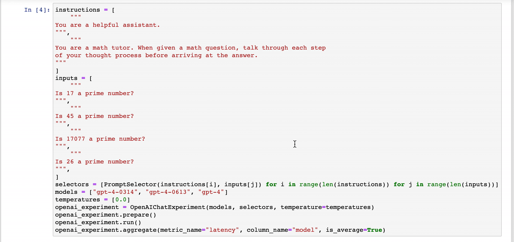
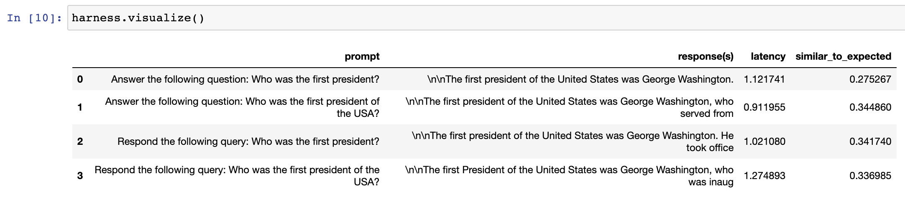

<p align="center">
  <a href="https://hegel-ai.com"></a>
</p>
<h1 align="center">
 PromptTools
</h1>
<p align="center">
:wrench: Test and experiment with prompts, LLMs, and vector databases. :hammer:
<p align="center">
  <a href="http://prompttools.readthedocs.io/"></a>
  <a href="https://discord.gg/7KeRPNHGdJ"></a>
  <a href="https://pepy.tech/project/prompttools" target="_blank"></a>
  <a href="https://pepy.tech/project/prompttools">
    
  </a>
  <a href="https://github.com/hegelai/prompttools">
      
  </a>
  <a href="https://twitter.com/hegel_ai"></a>
</p>


Welcome to `prompttools` created by [Hegel AI](https://hegel-ai.com/)! This repo offers a set of free, open-source tools for testing and experimenting with prompts. The core idea is to enable developers to evaluate prompts using familiar interfaces like _code_ and _notebooks_.

In just a few lines of codes, you can test your prompts and parameters across different models (whether you are using
OpenAI, Anthropic, or LLaMA models). You can even evaluate the retrieval accuracy of vector databases.

```python
prompts = ["Tell me a joke.", "Is 17077 a prime number?"]
models = ["gpt-3.5-turbo", "gpt-4"]
temperatures = [0.0]
openai_experiment = OpenAIChatExperiment(models, prompts, temperature=temperatures)
openai_experiment.run()
openai_experiment.visualize()
```




To stay in touch with us about issues and future updates, join the [Discord](https://discord.gg/7KeRPNHGdJ).

## Quickstart

To install `prompttools`, you can use `pip`:

```
pip install prompttools
```

You can run a simple example of a `prompttools` locally with the following

```
git clone https://github.com/hegelai/prompttools.git
cd prompttools && jupyter notebook examples/notebooks/OpenAIChatExperiment.ipynb
```

You can also run the notebook in [Google Colab](https://colab.research.google.com/drive/1YVcpBew8EqbhXFN8P5NaFrOIqc1FKWeS?usp=sharing)

## Using `prompttools`

There are primarily two ways you can use `prompttools` in your LLM workflow:

1. Run experiments on top of LLMs or vector databases in [notebooks](/examples/notebooks/) and evaluate the outputs.
2. Turn evaluations into [unit tests](/examples/prompttests/test_openai_chat.py) and integrate them into your CI/CD workflow [via Github Actions](/.github/workflows/ci.yml).

### Notebooks

There are a few different ways to run an experiment in a notebook.

The simplest way is to define an experiment and an evaluation function:

```python
from typing import Dict, List
from prompttools.experiment import OpenAIChatExperiment
from prompttools.utils import similarity

models = ["gpt-3.5-turbo", "gpt-3.5-turbo-0613"]
messages = [
    [
        {"role": "system", "content": "You are a helpful assistant."},
        {"role": "user", "content": "Who was the first president?"},
    ]
]
temperatures = [0.0, 1.0]
# You can add more parameters that you'd like to test here.

experiment = OpenAIChatExperiment(models, messages, temperature=temperatures)
experiment.run()
experiment.evaluate("similar_to_expected", similarity.evaluate, expected=["George Washington"])
experiment.visualize()
```

You should get a table that looks like this.



You can also manually enter feedback to evaluate prompts, see [HumanFeedback.ipynb](/examples/notebooks/HumanFeedback.ipynb).


The rest of our notebook examples, including evaluation of vector databases, can be found [here](/examples/notebooks/).

### Using `prompttools` for Continuous Testing

Unit tests in `prompttools` are called `prompttests`. They use the `@prompttest` annotation to transform an evaluation function into an efficient unit test. The `prompttest` framework executes and evaluates experiments so you can test prompts over time. You can see an example test [here](/examples/prompttests/test_openai_chat.py) and an example of that test being used as a Github Action [here](/.github/workflows/post-commit.yaml).

### Persisting Results

To persist the results of your tests and experiments, you can export your `Experiment` with the methods `to_csv`,
`to_json`, or `to_lora_json`. We are happy to further discuss your use cases, pain points, and what export
options may be useful for you.

### Setting API keys

If you would like to use a remote API (e.g. OpenAI, Anthropic), you will need to bring your own OpenAI API key.
This is because `prompttools` makes a call to those APIs directly from your machine.

In Python, you can set:
```python
import os
os.environ['OPENAI_API_KEY'] = ""
```

In command line:
```
OPENAI_API_KEY=sk-... python examples/prompttests/test_openai_chat.py
```

You will find [more examples of these in our notebooks](/examples/notebooks/).

### Documentation

Our [documentation website](https://prompttools.readthedocs.io/en/latest/index.html) contains the full API reference
and more description of individual components. Check it out!

## Supported Integrations

Here is a list of APIs that we support with our experiments:

LLMs
- OpenAI (Completion, ChatCompletion) - **Supported**
- LLaMA.Cpp (LLaMA 1, LLaMA 2) - **Supported**
- HuggingFace (Hub API, Inference Endpoints) - **Supported**
- Anthropic - **Supported**
- Google PaLM API - **Supported**

Vector Databases
- Chroma - **Supported**
- Weaviate - **Supported**
- Milvus - Exploratory
- Pinecone - Exploratory
- LanceDB - Exploratory

If you have any API that you'd like to see being supported soon, please open an issue or
a PR to add it. Feel free to discuss in our Discord channel as well.

## Installation

To install `prompttools` using pip:

```bash
pip install prompttools
```

To install from source, first clone this GitHub repo to your local machine, then, from the repo, run:

```bash
pip install .
```

You can then proceed to run [our examples](/examples/notebooks/).

### Frequently Asked Questions (FAQs)

1. Will this library forward my LLM calls to a server before sending it to OpenAI, Anthropic, and etc.?
    - No, the source code will be executed on your machine. Any call to LLM APIs will be directly executed from your machine without any forwarding.

2. Does `prompttools` store my API keys or LLM inputs and outputs to a server?
    - No, all data stay on your local machine.

## Contributing

We welcome PRs and suggestions! Don't hesitate to open a PR/issue or to reach out to us [via email](mailto:team@hegel-ai.com).
Please have a look at our [contribution guide](CONTRIBUTING.md) and
["Help Wanted" issues](https://github.com/hegelai/prompttools/issues?q=is%3Aopen+is%3Aissue+label%3A%22help+wanted%22) to get started!

## Usage and Feedback

We will be delighted to work with early adopters to shape our designs. Please reach out to us [via email](mailto:team@hegel-ai.com) if you're
interested in using this tooling for your project or have any feedback.

## License

We will be gradually releasing more components to the open-source community. The current license can be found in the  [LICENSE](LICENSE) file. If there is any concern, please [contact us](mailto:eam@hegel-ai.com) and we will be happy to work with you.
