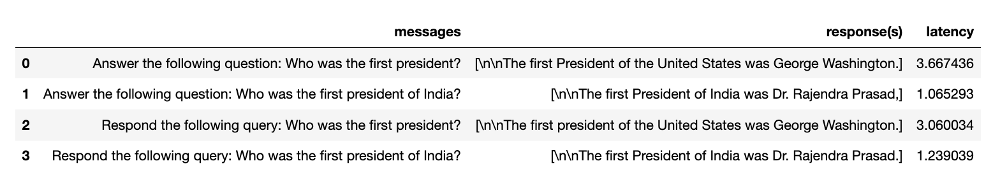
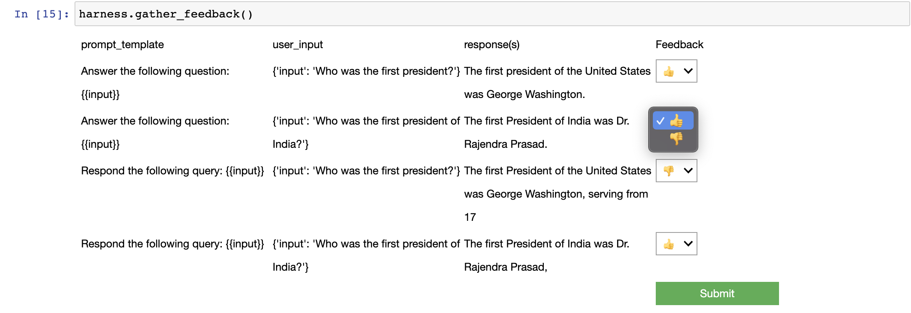

Using the library
===========

There are primarily two ways you can use ``prompttools`` in your LLM
workflow:

1. Run experiments in `notebooks <https://github.com/hegelai/prompttools/tree/main/examples/notebooks/>`__.
2. Write `unit tests <https://github.com/hegelai/prompttools/tree/main/examples/prompttests/test_openai_chat.py>`__ and
   integrate them into your CI/CD workflow `via Github
   Actions <https://github.com/hegelai/prompttools/tree/main/.github/workflows/post-commit.yaml>`__.

Notebooks
------------

There are a few different ways to run an experiment in a notebook.

The simplest way is to define an experimentation harness and an
evaluation function:

.. code:: python

   from prompttools.harness import PromptTemplateExperimentationHarness

   def eval_fn(prompt: str, results: Dict, metadata: Dict) -> float:
       # Your logic here, or use a built-in one such as `prompttools.utils.similarity`.
       pass

   prompt_templates = [
       "Answer the following question: {{input}}",
       "Respond the following query: {{input}}"
   ]

   user_inputs = [
       {"input": "Who was the first president?"},
       {"input": "Who was the first president of India?"}
   ]

   harness = PromptTemplateExperimentationHarness("text-davinci-003",
                                                  prompt_templates,
                                                  user_inputs)

   harness.run()
   harness.evaluate("metric_name", eval_fn)
   harness.visualize()  # The results will be displayed as a table in your notebook

If you are interested to compare different models, the `ModelComparison
example <https://github.com/hegelai/prompttools/tree/main/examples/notebooks/ModelComparison.ipynb>`__ may be of
interest.

For an example of built-in evaluation function, please see this example
of `semantic similarity
comparison <https://github.com/hegelai/prompttools/tree/main/examples/notebooks/SemanticSimilarity.ipynb>`__ for
details.

You can also manually enter feedback to evaluate prompts, see
`HumanFeedback.ipynb <https://github.com/hegelai/prompttools/tree/main/examples/notebooks/HumanFeedback.ipynb>`__.

..

   Note: Above we used an ``ExperimentationHarness``. Under the hood,
   that harness uses an ``Experiment`` to construct and make API calls
   to LLMs. The harness is responsible for managing higher level
   abstractions, like prompt templates or system prompts. To see how
   experiments work at a low level, `see this
   example <https://github.com/hegelai/prompttools/tree/main/examples/notebooks/BasicExperiment.ipynb>`__.

Unit Tests
------------

Unit tests in ``prompttools`` are called ``prompttests``. They use the ``@prompttest`` annotation to transform a
completion function into an efficient unit test. The ``prompttest`` framework executes and evaluates experiments
so you can test prompts over time. For example:

.. code-block:: python

    import prompttools.prompttest as prompttest

    @prompttest.prompttest(
        metric_name="is_valid_json",
        eval_fn=validate_json.evaluate,
        prompts=[create_json_prompt()],
    )
    def json_completion_fn(prompt: str):
        response = None
        if os.getenv("DEBUG", default=False):
            response = mock_openai_completion_fn(**{"prompt": prompt})
        else:
            response = openai.completions.create(prompt)
        return response.choices[0].text

The evaluation functions should accept one of the following as it's parameters:

* ``input_pair: Tuple[str, Dict[str, str]], results: Dict, metadata: Dict``
* ``prompt: str, results: Dict, metadata: Dict``
* ``messages: List[Dict[str,str], results: Dict, metadata: Dict``

You can see an example
test `here <https://github.com/hegelai/prompttools/tree/main/examples/prompttests/test_openai_chat.py>`__ and an example
of that test being used as a Github Action
`here <https://github.com/hegelai/prompttools/tree/main/.github/workflows/post-commit.yaml>`__.
